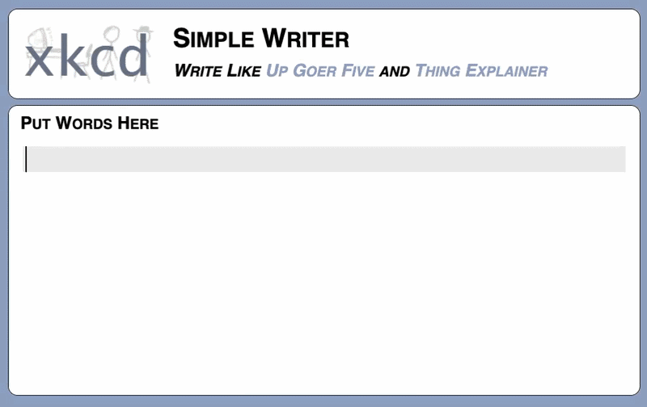

# Contributing to the Word Explainer

Welcome! Thank you for wanting to contribute to the [Word Explainer](https://softwaresaved.github.io/word-explainer/)! Whether you are here to add a new term, improve an existing definition, fix a bug, or just have an idea you would like to share - we are glad you are here.

This guide will walk you through everything you need to know to get started.

## Table of Contents

- [Contributing to the Word Explainer](#contributing-to-the-word-explainer)
  - [Table of Contents](#table-of-contents)
  - [Code of Conduct](#code-of-conduct)
  - [Ways to Contribute](#ways-to-contribute)
  - [Terms vs. Roles](#terms-vs-roles)
  - [The Up-Goer Five Rule](#the-up-goer-five-rule)
  - [Reporting Bugs and Suggesting Improvements](#reporting-bugs-and-suggesting-improvements)
  - [Submitting a Pull Request](#submitting-a-pull-request)
  - [Adding a New Entry](#adding-a-new-entry)
    - [Prerequisites](#prerequisites)
    - [Convenience Features](#convenience-features)
      - [Built-in help](#built-in-help)
      - [Shell completion](#shell-completion)
    - [Adding a New Role](#adding-a-new-role)
    - [Adding a New Term](#adding-a-new-term)
    - [Overriding an Existing Entry](#overriding-an-existing-entry)
  - [Repository Structure](#repository-structure)
  - [Licence](#licence)

## Code of Conduct

We want the Word Explainer to be a welcoming space for everyone. All contributors are expected to uphold our [Code of Conduct](CODE_OF_CONDUCT.md), which follows the [Contributor Covenant v2.1](https://www.contributor-covenant.org/version/2/1/code_of_conduct/).

TL;DR - be kind, be respectful, and be constructive. We are all here because we care about making research software more accessible.

## Ways to Contribute

There is no contribution too small. Here are the ways you can get involved:

CHECK LINKS ONCE MERGED TO MAIN

| Contribution                     | How                                                                                |
| -------------------------------- | ---------------------------------------------------------------------------------- |
| Suggest a new term or role       | [Open an issue](https://github.com/softwaresaved/word-explainer/issues/new/choose) |
| Report a bug                     | [Open an issue](https://github.com/softwaresaved/word-explainer/issues/new/choose) |
| Suggest a website improvement    | [Open an issue](https://github.com/softwaresaved/word-explainer/issues/new/choose) |
| Improve an existing definition   | [Open a pull request](https://github.com/softwaresaved/word-explainer/compare)     |
| Fix a bug or improve the website | [Open a pull request](https://github.com/softwaresaved/word-explainer/compare)     |

Not sure whether to open an issue or a pull request? If you have a ready-made definition or fix, open a pull request. If you have an idea but are not sure how to implement it, open an issue and the community can help.

## Terms vs. Roles

One of the things that makes the Word Explainer a little different is that we
distinguish between two types of entries:

- Terms (i.e. words we use): concepts, tools, or ideas used in research software (e.g. version control, open source, continuous integration).
- Roles (i.e. kinds of people): job titles or functions that people hold in research software (e.g. Research Software Engineer, Data Scientist).

Both live in the `words/` directory. For example,

```
words/
├── roles/
│   └── research-software-engineer/
│       └── index.qmd
└── terms/
    └── version-control/
        └── index.qmd
```

Each entry is a folder containing a single `index.qmd` file. Please do not add these manually. The [`create.py`](#adding-a-new-entry) should be used to scaffold them automatically.

## The Up-Goer Five Rule

All definitions in the Word Explainer must be written using only the **1000 most used words**. This is inspired by the [Up-Goer Five](https://xkcd.com/1133/) comic by XKCD, which describes a rocket using only simple words.

Before submitting a definition, please check it using the [Up-Goer Five Simple Writer](https://xkcd.com/simplewriter/). Any words highlighted in red are not in the allowed list and should be swapped out for simpler alternatives, like this example



> [!NOTE]
> This constraint is intentional. It pushes us to explain complex ideas in
> plain language that anyone can understand, regardless of their background.
> Give it a go! It is a surprisingly fun and thought provoking exercise.

When you are happy with your definition, entries are added using the [`create.py` script](#adding-a-new-entry), which validates your definition automatically at parse time. If any words are not in the allowed list, the script will exit with an error listing the offending words before any files are written. Nothing will be created until your definition is valid.

## Reporting Bugs and Suggesting Improvements

Found something broken or have an idea? Please use the appropriate issue template so we have all the information we need:

- [Suggest a new term or role](https://github.com/softwaresaved/word-explainer/issues/new?template=new_term_or_role.yml)
- [Report a bug](https://github.com/softwaresaved/word-explainer/issues/new?template=bug_report.yml)
- [Suggest a general improvement](https://github.com/softwaresaved/word-explainer/issues/new?template=general_improvement.yml)

## Submitting a Pull Request

1. [Fork the repository](https://github.com/softwaresaved/word-explainer/fork)
2. Clone your fork locally

   ```bash
   git clone https://github.com/<your-username>/word-explainer.git
   cd word-explainer
   ```

3. Create a new branch with a descriptive name:

   ```bash
   git checkout -b add-version-control-term
   ```

4. Make your changes (see [Adding a New Entry](#adding-a-new-entry) below)
5. Commit your changes with a clear message:

   ```bash
   git commit -m "Add definition for version control"
   ```

6. Push to your fork:

   ```bash
   git push origin add-version-control-term
   ```

7. [Open a pull request](https://github.com/softwaresaved/word-explainer/compare)
   using the appropriate template:
   - [Content contribution](https://github.com/softwaresaved/word-explainer/compare/main...main?template=content_contribution.md): adding or improving a term or role
   - [Bug fix or improvement](https://github.com/softwaresaved/word-explainer/compare/main...main?template=improvement_or_bug_fix.md): fixing a bug or improving the website

## Adding a New Entry

The [`create.py`](dev-tools/create.py) script scaffolds new entries for you,
handling the directory structure and Jinja templating automatically.

### Prerequisites

The script uses [`uv`](https://docs.astral.sh/uv/) to manage its dependencies such that a virtual environment is not needed and remains more self-contained. If you do not have `uv` installed, the [`uv` docs have great installation instructions](https://docs.astral.sh/uv/getting-started/installation/).

> [!NOTE]
> All commands must be run from the **project root directory** (the folder
> containing `words/`). The script will let you know if you are in the wrong
> place.

### Convenience Features

#### Built-in help

If you ever forget the available options, the script has built-in help so you
do not need to refer back to this guide. Run `--help` at any level to see
what is available. For example, for top-level help

```console
uv run dev-tools/create.py --help

 Usage: create.py [OPTIONS] COMMAND [ARGS]...

╭─ Options ───────────────────────────────────────────────────────╮
│ --install-completion          Install completion for the        │
│                               current shell.                    │
│ --show-completion             Show completion for the current   │
│                               shell, to copy it or customize    │
│                               the installation.                 │
│ --help                        Show this message and exit.       │
╰─────────────────────────────────────────────────────────────────╯
╭─ Commands ──────────────────────────────────────────────────────╮
│ role                                                            │
│ term                                                            │
╰─────────────────────────────────────────────────────────────────╯
```

For command-level help that shows the options for a specific command,

```console
uv run dev-tools/create.py role --help
uv run dev-tools/create.py term --help
```

#### Shell completion

The script also supports shell completion, which lets you tab-complete
commands and options directly in your terminal. To set it up, run:

```console
uv run dev-tools/create.py --install-completion
```

If you would prefer to set it up manually, you can inspect the completion
script first:

```console
uv run dev-tools/create.py --show-completion
```

### Adding a New Role

```bash
uv run dev-tools/create.py role \
  -r "Role Name" \
  -u "Simple up-goer five name" \
  -d "Long description explaining the role"
```

| Flag | Description                                                  | Required |
| ---- | ------------------------------------------------------------ | -------- |
| `-r` | Role name                                                    | Yes      |
| `-u` | Up-Goer Five version of the name                             | Yes      |
| `-d` | Description of the role                                      | Yes      |
| `-f` | Folder name (defaults to role name, lowercased with hyphens) | No       |
| `-o` | Override an existing entry                                   | No       |

Example:

```bash
uv run dev-tools/create.py role \
  -r "Principal Investigator" \
  -u "Money Getter" \
  -d "I lead a group of different people who work to understand the world."
```

### Adding a New Term

Terms can have a noun definition, a verb definition, or both, and at least one _must_ be provided. Each definition must be accompanied by a description.

```bash
# Noun only
uv run dev-tools/create.py term \
  -t "Term Name" \
  -n "Noun definition" \
  --noun-desc "Noun description"

# Verb only
uv run dev-tools/create.py term \
  -t "Term Name" \
  -v "Verb definition" \
  --verb-desc "Verb description"

# Both noun and verb
uv run dev-tools/create.py term \
  -t "Term Name" \
  -n "Noun definition" \
  --noun-desc "Noun description" \
  -v "Verb definition" \
  --verb-desc "Verb description"
```

| Flag          | Description                                                  | Required                                          |
| ------------- | ------------------------------------------------------------ | ------------------------------------------------- |
| `-t`          | Term name                                                    | Yes                                               |
| `-n`          | Noun definition                                              | No. At least one of noun or verb must be provided |
| `--noun-desc` | Noun description (required if `-n` is provided)              | No                                                |
| `-v`          | Verb definition                                              | No. At least one of noun or verb must be provided |
| `--verb-desc` | Verb description (required if `-v` is provided)              | No                                                |
| `-f`          | Folder name (defaults to term name, lowercased with hyphens) | No                                                |
| `-o`          | Override an existing entry                                   | No                                                |

> [!NOTE]
> A definition and its description must always be provided together,
>
> - _Not Allowed:_ Noun definition without a noun description
> - _Not Allowed:_ Noun description without a noun definition
> - _Correct:_ Noun definition and noun description together

### Overriding an Existing Entry

To update an existing entry, use the `-o` flag:

```bash
uv run dev-tools/create.py role -r "Role Name" -u "Simple name" -d "Description" -o
uv run dev-tools/create.py term -t "Term Name" -n "Noun definition" --noun-desc "Description" -o
```

> [!IMPORTANT]
> The `-o` flag will overwrite the existing `index.qmd` file entirely. Make
> sure you have committed any existing content before using it. This is mainly
> a convenience feature as mistakes happen.
>
> The Up-Goer Five validation still applies when overriding an
> existing entry. The script will reject invalid words before any files
> are written.

## Repository Structure

```
word-explainer/
├── .github/
│   ├── ISSUE_TEMPLATE/        # Issue form templates
│   └── PULL_REQUEST_TEMPLATE/ # PR templates
├── _extensions/               # Quarto extensions
├── a-to-z/                    # A-to-Z index page
├── about/                     # About page
├── assets/                    # Static assets (images, CSS)
├── dev-tools/
│   ├── create.py              # Script to scaffold new entries
│   └── templates/             # Jinja templates for terms and roles
├── words/
│   ├── roles/                 # Role entries
│   └── terms/                 # Term entries
├── _quarto.yml                # Quarto configuration
├── _brand.yml                 # Brand/theme configuration
├── index.qmd                  # Homepage
└── LICENSE                    # CC BY 4.0 licence
```

## Licence

By contributing to this repository, you agree that your contributions will be
shared under the
[CC BY 4.0 licence](https://creativecommons.org/licenses/by/4.0/). The same
licence that covers the rest of the project. This means anyone can share and
build upon your contribution, as long as they credit the original authors.

Thank you for taking the time to contribute! Every definition, fix, and idea makes the Word Explainer better for everyone.
