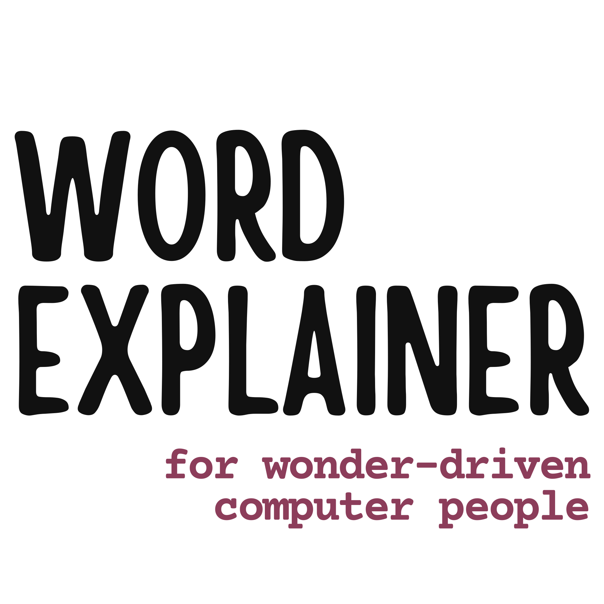

:::: {layout="[ 45, 55 ]"}

::: {#first-column}

[{.nolightbox fig-alt="Word Explainer for Wonder-Driven Computer People" width=100% height=auto}](a-to-z/)

:::

::: {#second-column}

## Translations for dRTPs {.title-heading}

What is a digital research technical professional (dRTP)? It is a question that's hard to answer, even to researchers, let alone those outside research.
This site uses the Up Goer Five Challenge, inspired by [this XKCD comic](https://xkcd.com/1133/), to give the dRTP community a shared language for describing what we do.
[**Find out more about the project and how to contribute**](about/){.to-pages} &ndash; or [try the challenge yourself](https://xkcd.com/simplewriter/)!

::: {.to-pages}

[**Explore the roles** (the "kinds of people")](words/roles/)

[**Browse the terminology** (the "words we use")](words/terms/)

:::

:::

::::
